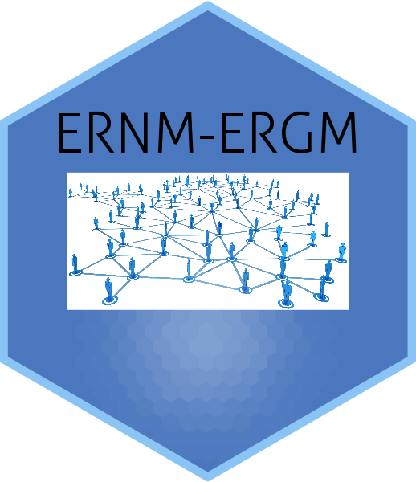

# Understanding Complex Networks with Exponential-family Random Network Models

## Table of Contents

- [Introduction](#Introduction)
- [Contents of Files in the Repository](#Contents-of-Files-in-the-Repository)
- [Abstract](#Abstract)
- [Installation](#Installation)


## Introduction

This repository provides the data and code used in the paper [Understanding Complex Networks with Exponential-family Random Network Models](https://drive.google.com/file/d/1TSJbSHiQIXXqTF3h76jfqAeTsAfxH8hQ/view?usp=sharing). It allows the reproduction of the analysis in that paper and also serves as a simple tutorial on how ERGM and ERNM models can be fit with open-source user-friendly software.

The paper compared two classes of statistical models for social networks, exponential-family random graph models (ERGMs) and exponential-family random network models (ERNMs). The ERGM class is the workhorse for complex networks, but essentially  only represent social influence processes in the models. ERNM are a new class of models, proposed by Ian E. Fellows that endogenously model both tie variables and nodal/dyadic covariates. These are able to model the joint effect of social influence and social selection processes (but not causally).

In the paper we argue that ERNM provide a better class of models for complex networks when the nodal/dyadic covariates are stochastic.

- For a further details of the paper, visit the
[Understanding Complex Networks with Exponential-family Random Network Models](https://drive.google.com/file/d/1TSJbSHiQIXXqTF3h76jfqAeTsAfxH8hQ/view?usp=sharing)

## Contents of Files in the Repository

- [Data](network.RData): Raw data we used in our paper.
- [MCMC Diagnostic Plots](https://github.com/Andrea-ZW/ERNM/tree/main/MCMC%20Diagnostics): MCMC diagnostic trace and distribution plots for ERNM and ERGM models fitted in the paper

## Abstract of the paper

The structure of many complex social networks is determined by nodal and dyadic covariates that are endogenous to the tie variables. While exponential-family random graph models (ERGMs) have been very successful in modeling social networks with exogenous covariates, they are often misspecified for networks where the covariates are stochastic. Exponential-family random network models (ERNMs) are an extension of ERGM that retain the desirable properties of ERGM, but allow the joint modeling of tie variables. In this paper, we compare the models in situations where the covariates are stochastic. We use as a case-study a friendship network among students within a school from the National Longitudinal Study of Adolescent Health. Within this network, the student's smoking behavior is likely endogenous to their friendship ties. We compare ERGM to ERNM to show how conclusions of ERGM modeling are improved by consideration of the ERNM framework.
This analysis supports the notion that ERNM are preferred when networks have stochastic covariates.

## Installation

### Package Installation

The analysis in the paper relies on three core packages from the [statnet suite](https://statnet.org).

* [ergm.tapered](https://github.com/statnet/ergm.tapered): To install from github, you can use the R command:

```{r}
# If devtools is not installed:
# install.packages("devtools")

devtools::install_github("statnet/ergm.tapered")
```

* [ernm](https://github.com/fellstat/ernm): To install from github, you can use the R command:

```{r}
# If devtools is not installed:
# install.packages("devtools")

devtools::install_github("fellstat/ernm")
```
Here is the sources of the [version used in the paper](Packages/ernm_1.1.tar.gz). To install this version you can use: `R CMD INSTALL ernm_1.1.tar.gz` or Rstudio's build in source installation methods.

### Data Processing

The [data](network.RData) shown in repository is already cleaned and formed as a list of `network` objects. It is a list of length 4 with each element being the network of grade 9-12, respectively.


### ERNM and ERGM models

The suggested models in the paper can be fitted with following code:

```
network_g9 <- network_addhealth_grade[[1]]

ergm_form <- network_g9 ~ edges + esp(0:2) + gwesp(0.5,fixed = T) + gwdegree(0.5,fixed = T)  + nodefactor("c.smoke") + nodematch('c.smoke') 
ernm_form <- network_g9 ~ edges() + esp(0:2) + gwesp(0.5,1) + gwdegree(0.5) + nodeCov("c.smoke") + nodeMatch("c.smoke") | c.smoke

ernm(ernm_form,r=2)
ergm.tapered(ergm_form,r=2, fixed=TRUE)
```

### Goodness of Fit & MCMC Diagnostics

The goodness of fit of fitted models can be checked by generating simulations on target network statistics and compares them to the observed graph statistics.

The MCMC Diagnostics for ERGM models use `mcmc.diagnostics()` to create simple diagnostic plots for MCMC sampled statistics produced from a fit. 


